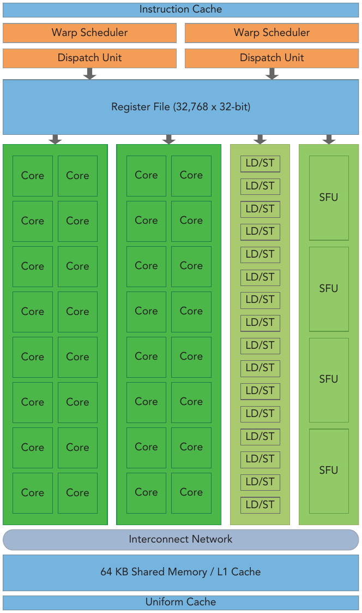
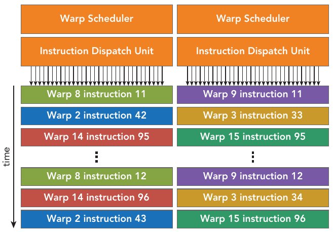
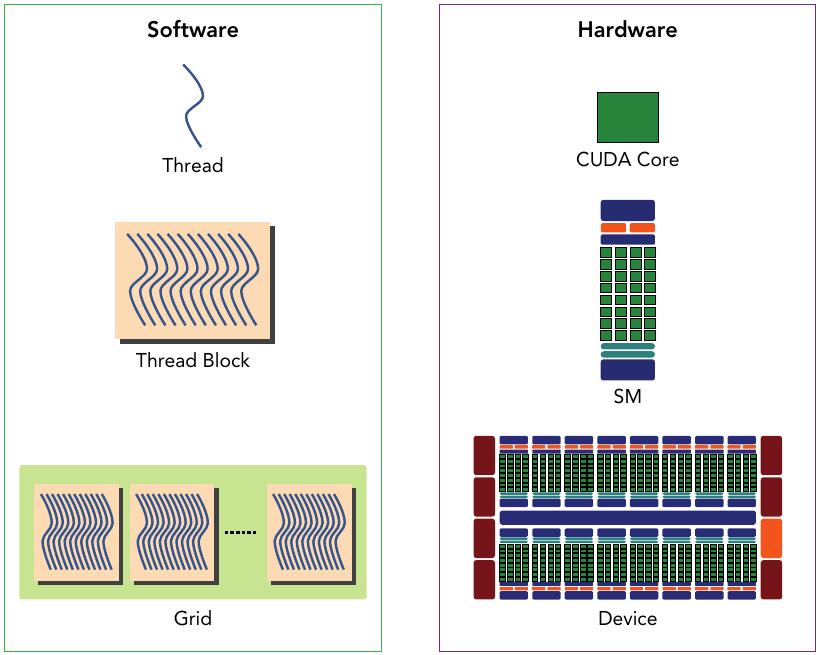
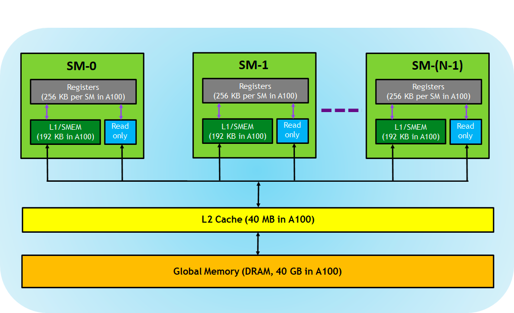
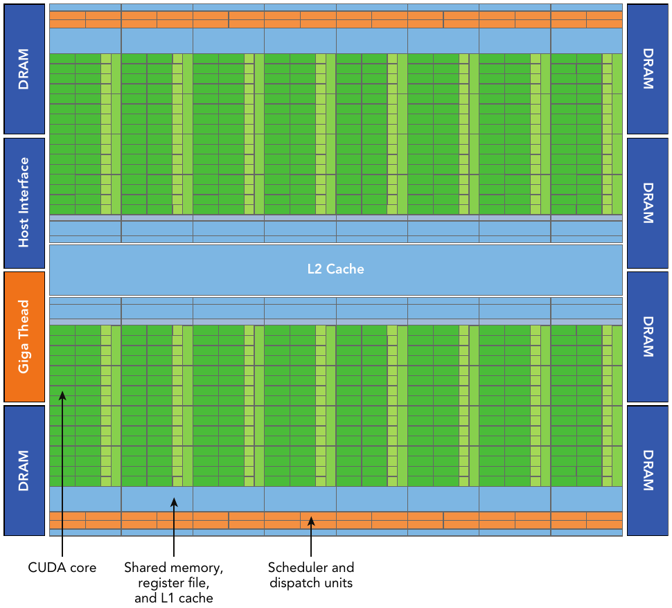
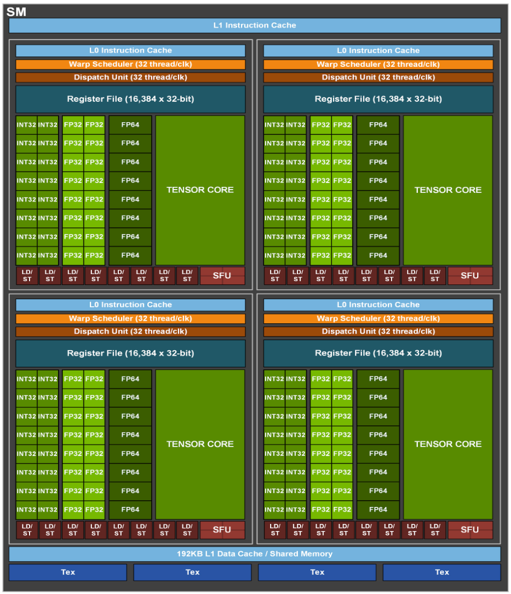
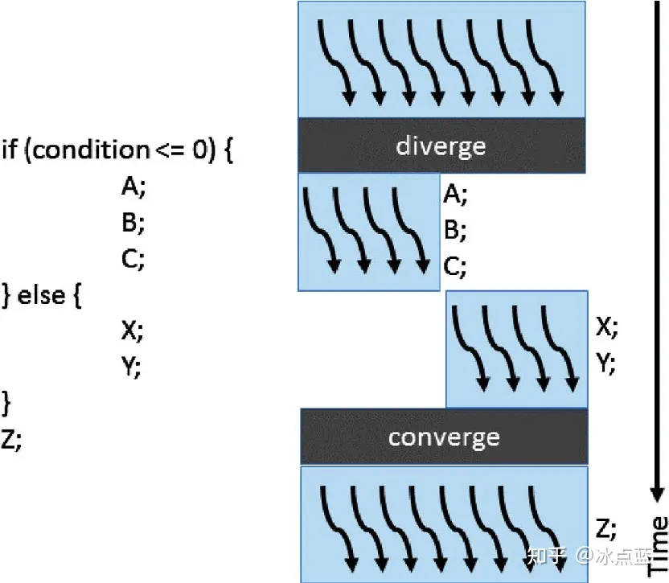
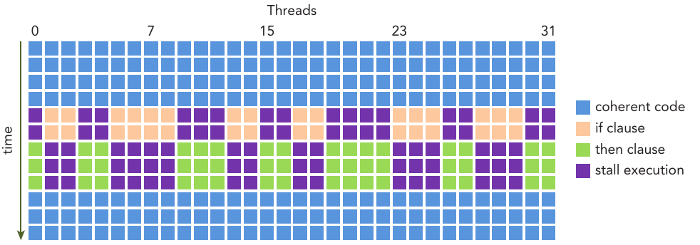
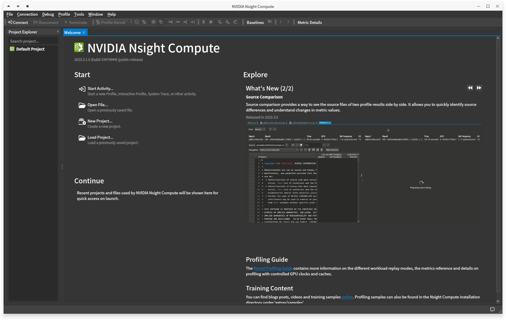

## Go Deeper into GPU Architecture

> The starting point of all optimizations is to better "squeeze" hardware performance through programming.

The GPU architecture is built around a scalable array of **Streaming Multiprocessors (SM)**. GPU hardware parallelism is achieved through the replication of this architectural building block. 

Each SM in a GPU is designed to support concurrent execution of hundreds of threads, and there are generally multiple SMs per GPU, so it is possible to have thousands of threads executing concurrently on a single GPU. When a kernel grid is launched, the thread blocks of that kernel grid are distributed among available SMs for execution. Once scheduled on an SM, the threads of a thread block execute concurrently only on that assigned SM. Multiple thread blocks may be assigned to the same SM at once and are scheduled based on the availability of SM resources. Instructions within a single thread are pipelined to leverage instruction-level parallelism, in addition to the thread-level parallelism you are already familiar with in CUDA.

Key components of a Fermi SM are:
- CUDA Cores
- Shared Memory/L1 Cache
- Register File
- Load/Store Units
- Special Function Units
- Warp Scheduler


Figure: Key components of a Fermi(a GPU architecture) SM

<!--truncate-->

**Each CUDA core has a fully pipelined integer arithmetic logic unit (ALU) and a floating-point unit (FPU) that executes one integer or floating-point instruction per clock cycle.**

For figure above(but not for all GPUs), each multiprocessor has 16 load/store units(LD/ST), allowing source and destination addresses to be calculated for 16 threads (a half-warp) per clock cycle. Special function units (SFUs) execute intrinsic instructions such as sine, cosine, square root, and interpolation. Each SFU can execute one intrinsic instruction per thread per clock cycle. Each SM features two warp schedulers and two instruction dispatch units. When a thread block is assigned to an SM, all threads in a thread block are divided into warps. The two warp schedulers select two warps and issue one instruction from each warp to a group of 16 CUDA cores, 16 load/store units, or 4 special function units. 


Figure: The two warp schedulers select two warps and issue one instruction from each warp to a group of 16 CUDA cores, 16 load/store units, or 4 special function units

The Fermi architecture(a famous GPU architecture developed by NVIDIA, compute capability 2.x), can simultaneously handle 48 warps per SM for a total of 1,536 threads resident in a single SM at a time.

CUDA employs a Single Instruction Multiple Thread (SIMT) architecture to manage and execute threads in groups of 32 called warps. All threads in a warp execute the same instruction at the same time. Each thread has its own instruction address counter and register state, and carries out the cur- rent instruction on its own data. Each SM partitions the thread blocks assigned to it into 32-thread warps that it then schedules for execution on available hardware resources.

:::success
The SIMT architecture is similar to the SIMD (Single Instruction, Multiple Data) architecture. Both SIMD and SIMT implement parallelism by broadcasting the same instruction to multiple execution units. A key difference is that SIMD requires that all vector elements in a vector execute together in a unifi ed synchronous group, whereas SIMT allows multiple threads in the same warp to execute independently. The SIMT model includes three key features that SIMD does not:

- Each thread has its own instruction address counter.
- Each thread has its own register state.
- Each thread can have an independent execution path.

Even though all threads in a warp start together at the same program address, it is possible for individual threads to have different behavior. SIMT enables you to write thread-level parallel code for independent, scalar threads, as well as data-parallel code for coordinated threads. 
:::

In CUDA programming, the number **32** is often referred to as a "magic number" because it holds special significance in terms of thread block size and warp size.
1. **Thread Blocks**: In CUDA, computations are organized into grids, which contain blocks, which in turn contain threads. The size of a block is specified during kernel launch and must be a multiple of 32 threads. Therefore, the number 32 is often used as a fundamental building block for determining the size of thread blocks.
2. **Warps**: In NVIDIA GPU architectures, threads are grouped into units called warps, typically consisting of 32 threads. Instructions in CUDA are executed at the warp level, meaning that each instruction is executed simultaneously across all threads within a warp. Therefore, understanding the warp size (32 threads) is crucial for optimizing performance in CUDA programs.
3. **Memory Access and Coalescing**: CUDA programs often benefit from memory coalescing, where threads within a warp access memory in a contiguous and coalesced manner. This means that when threads in a warp access memory, it is advantageous for them to access consecutive memory locations. The warp size of 32 threads aligns well with memory access patterns and helps achieve efficient memory access.


Figure: The corresponding components from the logical view and hardware view of CUDA programming.

Therefore, the number 32 is considered a "magic number" in CUDA programming because it forms the basis for thread block sizes, warp sizes, and many optimization techniques, contributing to efficient parallel execution on NVIDIA GPUs.

Sharing data among parallel threads may cause a race condition: Multiple threads accessing the same data with an undefined ordering, which results in unpredictable program behavior. CUDA provides a means to synchronize threads within a thread block to ensure that all threads reach certain points in execution before making further progress. However, no primitives are provided for inter-block synchronization.

Warps, the basic execution units, can be scheduled in any order within an SM. When a warp idles, another warp can be scheduled with no overhead. SM resources like registers and shared memory are limited and shared among threads. Understanding SM hardware helps optimize thread organization for performance.

### Physical Memory

In CUDA GPUs (Graphics Processing Units), different types of memory are used to facilitate efficient data access and management. In CUDA programming, optimizing memory access patterns and utilizing different memory types efficiently are crucial for achieving high performance in parallel computations.


Figure: Memory accessibility in a GPU

|               |              Global Memory              |      Shared Memory      |                Local Memory                 |             Constant Memory              |
| :-----------: | :-------------------------------------: | :---------------------: | :-----------------------------------------: | :--------------------------------------: |
| Accessibility | All the thread(as well as the host CPU) | Only blocks in the grid | Threads have their own private local memory | All the thread can visit constant memory |

Here's an overview of each type:

1. **Global Memory**:
   - Global memory is the largest and slowest memory type available on CUDA GPUs.
   - It is accessible by all threads in a CUDA kernel.
   - Data stored in global memory persists for the duration of the program.
   - It's typically used to store input and output data that needs to be shared across threads or between the CPU and GPU.

2. **Shared Memory**:
   - Shared memory is a fast, on-chip memory that is shared among threads within the same block.
   - It has lower latency and higher bandwidth compared to global memory.
   - Shared memory is used for data sharing and communication between threads within a block.
   - It is limited in size (typically in the range of 16KB to 96KB per block, depending on the GPU architecture).

3. **Local Memory**:
   - Local memory refers to the per-thread private memory space in CUDA.
   - Each thread has its own local memory.
   - Local memory is used to store thread-specific data and variables.
   - Accessing local memory is slower compared to accessing shared memory.

4. **Constant Memory**:
   - Constant memory is a special type of memory that is cached and read-only.
   - It is used to store data that is constant across all threads in a kernel.
   - Constant memory offers high bandwidth and low latency for read operations.
   - It is typically used for storing constants, lookup tables, or other read-only data.

Registers are not the same as shared memory in CUDA GPUs. Registers are a type of memory that exists per thread and are used for storing variables, intermediate values, and computation results during kernel execution. Each thread in a CUDA kernel has its own set of registers.


Figure: an abstract figure about GPU components

Let's understand them again:
- Registers: Each thread is private, which means that the registers allocated to this thread are not visible to other threads, and the compiler makes decisions about register utilization.
- L1/Shared memory (SMEM): Each SM has a fast on-chip scratched memory that can be used as L1 cache and shared memory. All threads in a CUDA block can share shared memory, and all CUDA Blocks running on a given SM can share the physical memory resources provided by the SM.
- Read-only memory: Each SM has instruction cache, constant memory, texture and RO cache, which is read-only for kernel code.
- L2 cache: The L2 cache is shared among all SMs, so every thread in every CUDA block can access this memory.
- Global memory: This is the framebuffer size of the GPU and DRAM located in the GPU.

### The Fermi Architecture

The Fermi architecture developed by NVIDIA, is the first complete GPU computing architecture to deliver the features required for the most demanding HPC applications. Fermi has been widely adopted(NVIDIA use it in GeForce, Quadro, and Tesla GPU product lines) for accelerating production workloads.

:::danger
NVIDIA's GPU architectures have progressed through several generations beyond Fermi, including Kepler, Maxwell, Pascal, Volta, Turing, and Ampere. Each generation typically introduces advancements in core architecture, memory technologies, performance, and power efficiency. 
We are talking about the Fermi architecture here because it's the very first generation of a complete GPU micro-architecture, and later architectures applyed several improvements on their previous ones. Understanding the Fermi architecture helps you to understand most of them.
For the most accurate and up-to-date information on the core counts and specifications of specific GPU models within these newer architectures, it's best to refer to the official documentation provided by NVIDIA or reputable hardware review sources.
:::


Figure: logical block diagram of the Fermi architecture focused on GPU computing with graphics-specific components largely omitted. 

Fermi includes a coherent 768 KB L2 cache, shared by all 16 SMs. Each SM is represented by a vertical rectangular strip containing:
- Execution units (CUDA cores)
- Scheduler and dispatcher units that schedule warps
- Shared memory, the register file, and L1 cache

:::success
For other achitecture and innovations, you can refer to NVIDIA official documentation for up-to-date information.
:::

### More recent Ampere architecture

Ampere is a GPU architecture developed by NVIDIA, succeeding the Turing architecture. Introduced in 2020, Ampere represents a significant leap in performance, efficiency, and capabilities for a wide range of computing tasks, including gaming, AI, data analytics, and scientific computing. It has **Enhanced Tensor Cores** which offer higher performance for AI and machine learning workloads, enabling faster training and inference tasks. It also has **Increased CUDA Cores**, resulting in improved raw compute performance for parallel processing tasks.


Figure: GA100 Streaming Multiprocessor (SM), used on NVIDIA A100, NVIDIA's 8th gen GPU for data center

As can be seen from the figure above, the SM architecture of GA100 is much more complex than that of older Fermi GPUs, and it occupies a larger area. Each SM includes 4 blocks, each block has an independent L0 instruction cache, Warp scheduler, distribution unit, and 16384 32-bit registers, which allows each SM to execute 4 different sets of instruction sequences in parallel. The 4 blocks share the L1 instruction cache and data cache, shared memory, and texture units. It can also be seen from the figure that the number of computing units of INT32 is the same as that of FP32, while the number of computing units of FP64 is half of FP32.

In addition to INT32, FP32, and FP64 computing units, each SM has an additional 4 wide and fat Tensor Cores. This is a heavy weapon for accelerating Deep Learning calculations. It has been developed to the third generation. Each clock cycle can Performing 1024 times of FP16 multiplication and addition operations, compared with Volta and Turing, the throughput of each SM is doubled, and the supported data types are also richer, including FP64, TF32, FP16, BF16, INT8, INT4, and INT1.

Besides, It has:
- 192 KB combined shared memory and L1 data cache, 1.5 times larger than V100 SM
- The 40 MB L2 Cache is 7 times larger than the V100. With the new partitioned crossbar structure (2 L2 Cache), it provides 2.3 times the L2 cache read bandwidth of the V100.
- The new asynchronous copy instruction loads data directly from "global memory" into "shared memory", bypassing the L1 cache and eliminating the need for intermediate register files;

## CUDA Execution Model

Through the few examples provided before, you learned how to organize threads into grids and blocks to deliver the best performance. While you can find the best execution configuration through trial-and-error, you might be left wondering why the selected execution configuration outperforms others. You might want to know if there are some guidelines for selecting grid and block configurations.

Therefore, we are going to talk about the CUDA execution model. In general, an execution model provides an operational view of how instructions are executed on a specific computing architecture. The CUDA execution model exposes an abstract view of the GPU parallel architecture, allowing you to reason about thread concurrency. 

### The nature of Warp Execution

When launching a kernel, from your perspective, it seems that all threads in the kernel run in parallel. From a logical point-of-view this is true, but from the hardware point of view not all threads can physically execute in parallel at the same time. We have already went through the concept of grouping 32 threads into a single execution unit: **a warp**.


Figure: How threads are organized and executed through Warps.

According to the SIMD model, the smallest execution unit of SM is Warp, and there are multiple threads in a Warp. SM execution unit SPs share a single instruction fetch/dispatch, and these threads apply the same instruction to different data. Therefore, all threads in a warp will always have the same execution time.
Warp is the basic execution unit of SM. A Warp contains 32 parallel threads, and these 32 threads execute in SIMT (Single-Instruction, Multiple-Thread, single instruction multi-thread) mode. That is to say, all threads execute the same instruction, and each thread uses its own data to execute the instruction.

The threads in a warp must be in the same block. The same block will not be in two SMs, that is, the block will call multiple warps. If the number of threads in the block cannot be divided by the number of warp threads, the last warp will not be filled, the thread in the unfilled warp is inactive. As long as a warp is called, SM resources will be consumed, but some threads in the warp are inactive.

In early GPUs, an SM could only execute one instruction for a single warp at a time. With the development of GPU, one SM can now execute the instructions of multiple warps at the same time. However, even so, the number of warps that can be executed simultaneously by an SM is still less than the number of warps after the Blocks passed to the SM are split. This raises a natural question: if each SM can only execute a subset of the incoming warps at the same time, why do we need to pass in so many warps? In fact, this design is like letting the processor do one heavy task while silently handling other things in the background. For example, when a kernel is waiting to read data from global memory, passing in more thread warps can allow the CUDA processor to take advantage of this waiting time and perform other calculations or operations at the same time to fully utilize processor resources and improve overall performance.

**SM implements zero-overhead warp scheduling.** The point here is: **Threads in a warp execute the same instructions and have the same execution time. If a thread is blocked, other threads in the same warp will be blocked**.

Therefore, SM adopts the following strategy when executing operations: During the execution of a thread warp, if this thread warp encounters a long delay operation, SM can execute other fast thread warps while waiting for the long delay operation to complete, after the long delay operation of the waiting warp ends, the SM continues to execute the previously unfinished operation.


Figure: Example Execution Timing for a SM

Figure above is an illustration of how this strategy works:
- Warps whose next instruction has its operands ready for consumption are eligible for execution
- Eligible warps are selected for execution on a prioritized scheduling policy
- All threads in a warp execute the same instruction when selected

:::success
The warp context contains three parts:
- Program counter
- Register
- Shared memory

When a block gets enough resources, it becomes an active block. The warp in the block is called active warp. Active warps can be divided into the following three categories:

- Selected warp: warp being selected
- Stalled warp: a warp that is not ready for execution.
- Eligible warp: not selected, but is ready to be executed.

The warp scheduler in SM will select active warps for execution in each cycle. Whether a warp is "suitable for execution" needs to meet the following two conditions:

- 32 CUDA cores are available
- All parameters and depending values are ready
:::

### Warp Divergence

In CUDA programming, warp divergence refers to a situation where threads within the same warp (a group of threads executed together in lockstep) take different execution paths. Threads in a warp execute the same instructions and have the same execution time. If a thread is blocked, other threads in the same warp will be blocked, hence warp divergence. Therefore, **Warp divergence will only appear in the same warp.**


Figure: What is warp divergence

In the figure above, the `if else` statement divides the 8 threads in the thread warp (assuming 8 threads in a thread warp) into 4 left and 4 right. When the left 4 runs A, B, and C, the right 4 You can only wait; similarly, when running X and Y on right 4, left 4 can only wait. Only after the control statement is completed can Z be run together with it. Such serial execution of different paths makes both left 4 and right 4 wait for a period of time, resulting in a waste of computing resources.

As you can see, a simple way to have warp divergence is to have if-else conditioning in your threads, here is another example:
```cpp
if (threadIdx.x % 2) {...} else {...}
```

Figure: Another example of having warp divergence

In the `if else` example above, the threads in the same thread warp are divided into odd-numbered threads and even-numbered threads according to their numbers. However, this brings about a problem. All threads in the thread warp first calculate the logical operations in the if statement, so the odd-numbered threads are It is activated and performs the operation in if, while the even-numbered threads that are not activated can only wait. Assuming this is an if else statement, then when it is the else's turn, the odd number of threads that are not activated are waiting. Since the current GPU always executes different paths in series, we have caused a waste of 50% of computing resources.

### Avoiding Warp Divergence

However, not all the `if else` statement will cause warp divergence.

### Scheduler


## Advanced Memory Management

As a C programmer, when writing code just for correctness you can safely ignore the cache line size; however, when tuning code for peak performance, you must consider cache characteristics in your code structure. This is true for CUDA C programming as well. As a CUDA C programmer, you must have some understanding of hardware resources if you are to improve kernel
performance. If you do not understand the hardware architecture, the CUDA compiler will still do a good job of optimizing your kernel, but it can only do so much. Even basic knowledge of the GPU architecture will enable you to write much better code and fully exploit the capability of your device.

### Unified Memory

Previously, one of the most common mistakes made by those learning to program in CUDA C is to improperly dereference the different memory spaces. For the memory allocated on the GPU, the device pointers may not be dereferenced in the host code. If you improperly use an assignment, for example:
```cpp
gpuRef = d_C
```
instead of using:
```cpp
cudaMemcpy(gpuRef, d_C, nBytes, cudaMemcpyDeviceToHost)
```
the application will crash at runtime.

To help avoid these types of mistakes, Unified Memory was introduced with CUDA 6, which lets you access both CPU and GPU memory by using a single pointer. 


## Performance and Optimization

### Profile-Driven Optimization

Profiling is the act of analyzing program performance by measuring:
- The space (memory) or time complexity of application code
- The use of particular instructions
- The frequency and duration of function calls

Profiling is a critical step in program development, especially for optimizing HPC application code. Profiling often requires a basic understanding of the execution model of a platform to help make application optimization decisions.

To identify the performance bottleneck of a kernel, it is important to choose appropriate performance metrics and compare measured performance to theoretical peak performance.  There are three common limiters to performance for a kernel that you may encounter:
- Memory bandwidth
- Compute resources
- Instruction and memory latency


:::success
In CUDA profiling, an event is a countable activity that corresponds to a hardware counter collected during kernel execution. A metric is a characteristic of a kernel calculated from one or more events. Keep in mind the following concepts about events and metrics:
- Most counters are reported per streaming multiprocessor but not the entire GPU.
- A single run can only collect a few counters. The collection of some counters is mutually exclusive. Multiple profiling runs are often needed to gather all relevant counters.
- Counter values may not be exactly the same across repeated runs due to variations in GPU execution (such as thread block and warp scheduling order).
:::

### NVIDIA Nsight Compute

Profiling tools provide deep insight into kernel performance and help you identify bottlenecks in kernels. Nsight Compute focuses on low-level performance analysis of CUDA (Compute Unified Device Architecture) kernels. It enables developers to profile CUDA kernels at a granular level, revealing information such as instruction throughput, memory access patterns, occupancy, and warp divergence. Nsight Compute helps optimize kernel performance and identify opportunities for parallelization and optimization.

:::success
Nsight Compute is optional in CUDA installation package on Windows, once it is installed, it shoud appear in your start up menu. If you're using some Linux distributions, you should check [NVIDIA official nsight systems guide](https://developer.nvidia.com/nsight-systems/get-started) and install it manually.

Specially, if you are using Arch Linux (I'm using Arch Linux at the time) then you should be able to get things ready using pacman:
```bash
# archlinux with pacman only
sudo pacman -S nvidia cuda cudnn cuda-tools
```
The command line above should install NVIDIA driver, CUDA, CUDNN, as well as NVIDIA's GPU programming toolkit (extra tools: nvvp, nsight) all together.
:::

You can start Nsight Compute Graphical interface from start up menu on windows or type `ncu-ui` in terminal on Arch Linux if you installed `cuda-tools` package. For other Linux distributions, you can find out how to launch it by your self.


Figure: How NVIDIA Nsight Compute grapical interface looks like

Performance optimization revolves around four basic strategies:

- Maximize parallel execution to achieve maximum utilization;
- Optimize memory usage to achieve maximum memory throughput;
- Optimize instruction usage to achieve maximum instruction throughput;
- Minimize memory thrashing.


### Frequently Asked Questions

- [What is the difference between cuda codes vs tensor cores?](https://stackoverflow.com/questions/47335027/what-is-the-difference-between-cuda-vs-tensor-cores)
