## 绪论：语言及其描述

形式语言使用数学符号和规则堆语言进行形式化的描述。形式语言常用于确切地描述和定义高级语言，在编译器设计中起到重要作用。形式语言是研究符号的语言，仅考虑符号之间的关系，不考虑符号的含义。

:::note
1956 年，乔姆斯基（N.Chomsky）首次采用马尔可夫（Markov）模型描述自然语言，从语言学和数学的角度对有限状态模型、短语结构模型和转换模型进行了理论上的分析，建立了形式语言理论。
:::

乔姆斯基将语言形式地定义为==由一个字母表的字母组成的一些串的集合==。对于任意一个**语言**，有一个**字母表**，可以在字母表上按照一定的**形成规则**定义一个**文法**，这个文法产生的所有**句子**组成的集合就是文法所产生的**语言**。

### 基本概念

**字母表**（alphabet）是一个非空有穷集合，字母表中的元素称为该字母表的一个**字母**（letter），也可以叫做**符号**（symbol），或者**字符**（character）。

:::success
**定义**：设 $\Sigma_1$ 和 $\Sigma_2$ 是两个字母表， $\Sigma_1$ 和 $\Sigma_2$ 的乘积：

$$
\Sigma_1 \Sigma_2 = \{ab | a\in\Sigma_1,b\in\Sigma_2\}
$$

:::

:::success

**定义**：设 $\Sigma$ 是一个字母表，$\Sigma$ 的 $n$ 次幂（power）递归的定义为：

$$
\begin\{align\}
(1) \Sigma^0 &= \{\epsilon\}\\
(2) \Sigma^n &= \Sigma^{n-1}\Sigma, n\ge 1
\end\{align\}
$$

:::

:::success
**定义**：设 $\Sigma$ 是一个字母表
$\Sigma$ 的正闭包：

$$
\Sigma^+ = \Sigma\cup\Sigma^2\cup\Sigma^3\cup...
$$

$\Sigma$ 的克林闭包：

$$
\Sigma^* = \Sigma^0 \cup \Sigma^+ = \Sigma^0\cup\Sigma\cup\Sigma^2\cup\Sigma^3\cup...
$$

:::

由于 $\Sigma^0 = \{\epsilon\}$，所以克林闭包看上去就是比正闭包多了个 $\epsilon$。

:::warning
**典型问题**：判断给定的字符串 $\omega$ 是否属于某个具体的语言 $L$，即是否 $\omega \in L$。
:::

上述问题是一个可判定问题。例如，编译器判断程序语言是否能被正常编译，在检查语法时就需要解决这个问题。

:::success
**定义**：设 $\Sigma$ 是一个字母表，$\forall x \in \Sigma^*$，则 $x$ 叫做 $\Sigma$ 上的一个句子。两个句子相等，当且仅当他们对应位置上的字符都相等。
:::

注：长度为 0 的字符串叫**空句子**，将空句子记作 $\epsilon$。

:::success
**定义**：若 $\Sigma$ 为字母表且 $\forall L \subseteq \Sigma^*$，则 $L$ 称为字母表 $\Sigma$ 上的语言。
:::

请注意，语言的一个重要约束时字母表时有穷的。

## 有穷自动机

### 确定的有穷自动机（Deterministic Finite State Automata，DFA）

:::success
**定义**：确定的有穷自动机 `A` 为五元组：

$$
A = (Q, \Sigma, \delta, q_0, F)
$$

- $Q$：有穷状态集
- $\Sigma$：字母表或有穷输入符号集
- $\delta$：$Q\times \Sigma \rightarrow Q$，状态转移函数
- $q_0 \in Q$：初始状态
- $F \subseteq Q$：终结状态集或接受状态集
  :::

有穷自动机的有穷主要是指状态转移函数 $\sigma(q,a)=p$ 的输出是由当前状态和输入唯一确定的，不具有不确定的情况。

**Example**: 请设计 DFA，在任何由 0 和 1 构成的串中，接受含有 01 子串的全部串。

首先，考虑所有可能的状态：
q1. 目前还没有遇到 0
q2. 刚遇到了 0，还没有遇到 1
q3. 遇到了 01
因此 DAF `A` 可以定义为：

$$
A = (\{q_1,q_2,q_3\},\{0,1\},\delta ,q_1, \{q_3\})
$$

其中，$\delta$ 是：

$$
\delta(q_1,1) = q_1,
\delta(q_1,0) = q_2\\
\delta(q_2,0) = q_2,
\delta(q_2,1) = q_3\\
\delta(q_3,0) = q_3,
\delta(q_3,1) = q_3
$$

:::note
**状态转移图**
如何从五元组描述出状态转移图：

- 每个状态 $q$ 对应一个节点，用圆圈表示；
- 状态转移函数 $\delta(q,a)=p$ 为一条从 $q$ 到 $p$ 且标记为字符 $a$ 的有向边；
- 开始状态 $q_0$ 用一个标有 start 的箭头指向标注；
- 接收状态的节点，用双圆圈表示；
  :::

例如，上述 Example 中的 DFA 可以表示为：

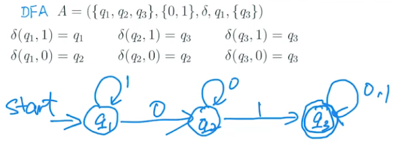

:::warning
**典型问题**：设计 DFA 使其接受且仅接受给定的语言 $L$。
:::

**Example**: 若 $\Sigma = \{0,1\}$，给出接受全部含有奇数个 1 的串 DFA。

从题目描述中可以看出，该状态机的两种状态为“已经输入偶数个 1”以及“已经输入奇数个 1”。

q1：有偶数个 1
q2：有奇数个 1

初始状态输入了 0 个 1，所以属于 q1。状态转移函数描述为：

$$
\delta(q_1,0) = q_1,
\delta(q_1,1) = q_2\\
\delta(q_2,0) = q_2,
\delta(q_2,1) = q_1
$$

状态转移图：

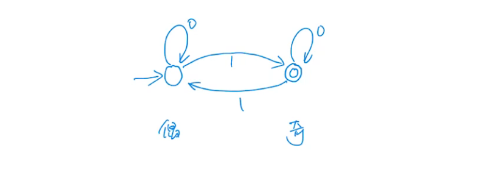

**Example**: 若 $\Sigma = {0,1}$，给出 DFA 接受全部含有偶数个 0 和偶数个 1 的串。

听上去像是两个简单 DFA 的笛卡尔积

需要四个不同的状态：

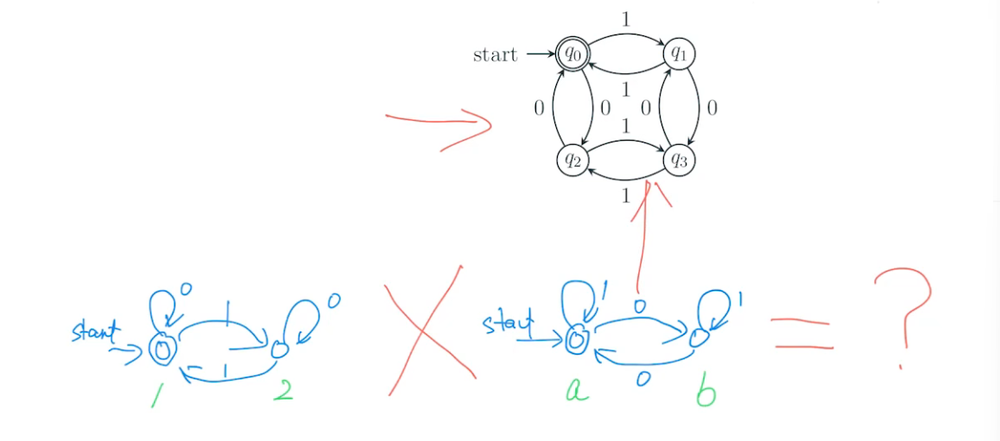

**Example**: 设计 DFA 接受 $L = \{w\in\{0,1\}^* | w 倒数3个字符至少有一个是1 \}$。

### DFA 的扩展转移函数

$\delta$ 可以表示字符之间的状态转移，但是不能表示字符串。为了研究方便，提出扩展的转移函数 $\hat\delta:Q\times \Sigma^* \rightarrow Q$ 为：

$$
\hat\delta(q,w) = \left\{
\begin\{align\}
q&,&w=\epsilon\\
\delta(\hat\delta(q,x),a)&,&w=xa \\
\end\{align\}
\right.
$$

上式就是扩展转移函数 $\hat\delta$ 的递归定义。若输入是空串，$q$ 保持不变；若 $q$ 不是空串，则料理 $q$ 除去最后一个字符 $w$ 的部分组成的状态在输入为 $w$ 时的状态转移。

:::success
**定义**：若 $D = (Q,\Sigma,\delta,q_0,F)$ 是一个 DFA，则 $D$ 接受的语言为：

$$
L(D) = \{w\in\Sigma^* | \hat\delta(q_0,w)\in F\}
$$

如果语言 $L$ 是某个 DFA D 的语言，即 $L = L(D)$，则称 L 是==正则语言==。
:::
:::note
**Tips**
空集 $\emptyset$ 空串 $\{\epsilon\}$ 都是正则语言。
若 $\Sigma$ 是字母表，$\Sigma^*,\Sigma^n$都是正则语言。
:::

例如，接受全部含有 01 字串的 DFA，$\hat{delta}$ 处理输入 0101 的过程为：

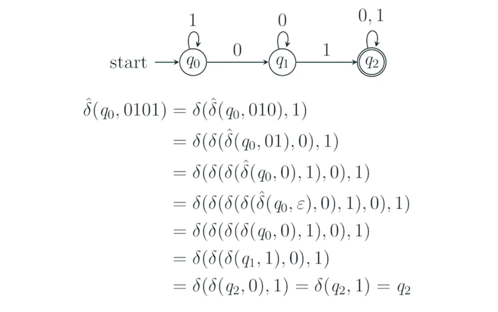

:::warning
请注意：

- 扩展转移函数$\hat{dalta}$并不是必须从开始状态$q_0$开始处理字符串的。它可以从任意位置开始。
- 对任意的串 $w,\hat\delta$ 保证一定会跳转到唯一确定状态。
  :::

:::warning
**典型问题**：设计语言 $L$ 使其被给定的 DFA 接受。
:::

**Example**:

设计 DFA 接受 $\{0,1\}$ 上的字符串 $w$

### 非确定有穷自动机（Nondeterministic Finite State，NFA）

:::success
**定义**：非确定有穷自动机 `A` 为五元组：

$$
A = (Q,\Sigma,\delta,q_0,F)
$$

$Q$：有穷状态集
$\Sigma$：有穷输入符号集（字母表）
$\delta$：$Q\times \Sigma \rightarrow 2^Q$ 为状态转移函数，其中$2^Q=\{S|S\subseteq Q\}$
$F\subseteq Q$：终结状态集或接受状态集
:::

**Example**:  
构造接受全部以 01 结尾的串的 NFA。

五元组为：$A=\{\{q_0,q_1,q_2\},\{0,1\},\delta,q_0,\{q_2\}\}$，状态转移函数$\delta$为：

$$
\begin\{align\}
&\delta\{q_0,0\} = \{q_0,q_1\}&,&
\delta\{q_0,1\} = \{q_0\}\\
&\delta\{q_1,0\} = \emptyset&,&
\delta\{q_1,1\} = \{q_2\}\\
&\delta\{q_2,0\} = \emptyset&,&
\delta\{q_2,1\} = \emptyset
\end\{align\}
$$

状态转移表：

|                   | 0             | 1           |
| ----------------- | ------------- | ----------- |
| $\rightarrow q_0$ | $\{q_0,q_1\}$ | \{q_0\}     |
| $q_1$             | $\emptyset$   | $\{q_2\}$   |
| $*q_2$            | $\emptyset$   | $\emptyset$ |

:::danger
上述例子中，在$q_1$处输入 0,或者在$q_2$处输入任何字符都是为定义的。有穷自动机都会“卡住”。如果 NFA 处于“卡住”的状态，认为不接受。

上述例子在进行匹配的过程中会出现多个不接受的情况，但是对于有穷自动机来说，只要有一个情况被接受，就表明这个字符串被接受。  
按照操作系统中进程`fork`的概念，可以理解为每当当前输入会跳转到多个目标状态时，自动机就会被`fork`。其中任何一个自动机达到了终结状态即可认为接受字符串。
:::

:::warning
**典型问题**：设计 NFA 使其接受语言$L$。
:::

**Example**: 设计 $L = \{w\in\{0,1\}^* | w 倒数3个字符至少有一个是1 \}$ 对应的 NFA。

在之前的 DFA 中，我们给出如下解：

对于 NFA，由于引入了不确定性，可以写出这样的解：

其中如果倒数第一个是 1 就从$q_0$直接跳转到$q_3$，如果倒数第二个是 1 就跳转到$q_2$，如果倒数第三个是 1 就跳转到$q_3$。

### NFA 的扩展转移函数

同理于 DFA 的扩展转移函数，为了方便的表示 NFA 处理字符串的过程，在 NFA 也引入扩展转移函数，用于递归地表示字符串的处理过程。

:::success
**定义**：若 $N = (Q,\Sigma,\delta,q_0,F)$ 是一个==NFA==，则 $N$ 接受的语言为：

$$
L(N) = \{w\in\Sigma^* | \hat\delta(q_0,w)\cap F \neq \emptyset\}
$$

如果语言 $L$ 是某个 NFA N 的语言，即 $N = L(N)$，则称 L 是==正则语言==。
:::

:::warning
**典型问题**：设计语言 $L$ 使其被给定的 NFA 接受。
:::

**Example**:

$L=\{w\in\{0,1\}^* | w的首尾字母相同\}$

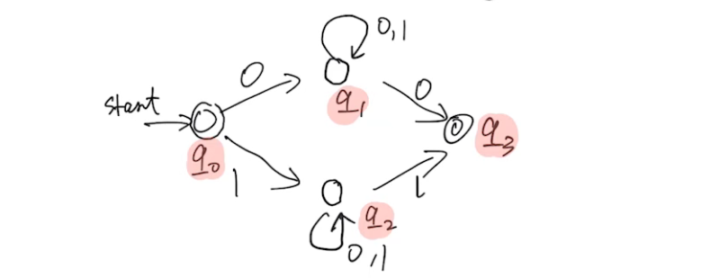

**Example**:

$L=\{w\in\{0,1\}^* |\, w\, either\, begin\, or\, ends\, with\, 01.\}$

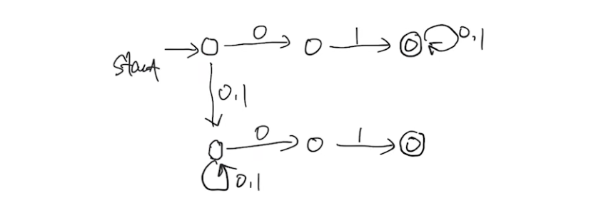

### DFA 与 NFA 的等价性

:::success
**定理**：如果语言 $L$ 被 NFA 接受，当且仅当 $L$ 被 DFA 接受。
:::

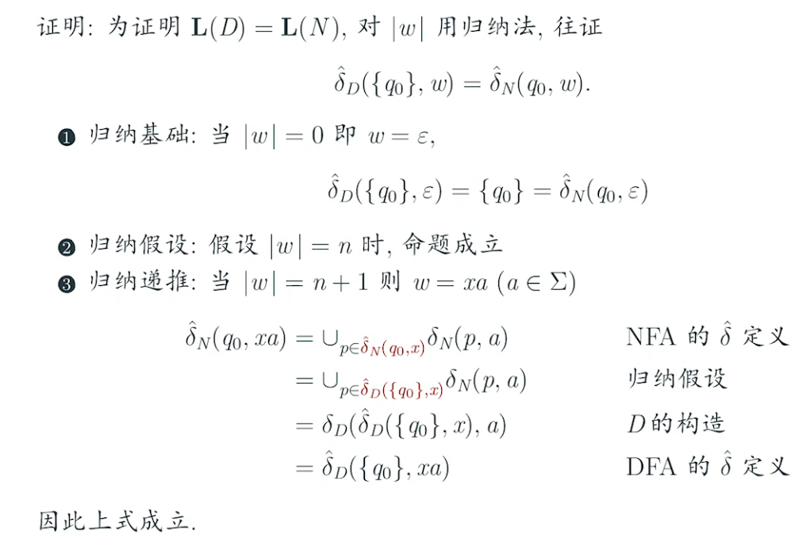
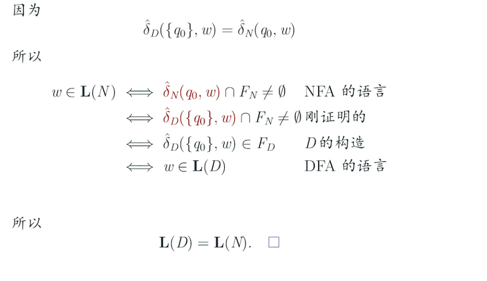

因此非确定性本身并没有改变有穷自动机识别的能力。

:::warning
**典型问题**：使用子集构造法构造与 NFA 等价的 DFA。
:::

**Example**:

这种题是通过状态转移表来做的。因为要构造 DFA，因此要将 NFA 中“状态的集合”变为“状态”。一个简单的办法是从开始状态出发，将所有 $q$ 变成 $q$ 的子集。例如：

第一步：起始状态$q_0$ 变为 $\{q_0\}$

|                     | 0   | 1   |
| ------------------- | --- | --- |
| $\rightarrow {q_0}$ |     |     |

第二步：参考原表，$q_0$ 可以接收 0 去 $q_0,q_1$，也可以接收 1 去$q_0$

|                     | 0             | 1         |
| ------------------- | ------------- | --------- |
| $\rightarrow {q_0}$ | $\{q_0,q_1\}$ | $\{q_0\}$ |

第三步：参考原表，刚才能到达的新状态是$\{q_0,q_1\}$，$\{q_0\}$已经有了。所以新增$\{q_0,q_1\}$：

|                     | 0             | 1         |
| ------------------- | ------------- | --------- |
| $\rightarrow {q_0}$ | $\{q_0,q_1\}$ | $\{q_0\}$ |
| $\{q_0,q_1\}$       |               |           |

第四步：参考原表，$\{q_0,q_1\}$ 可以接收 0 变为 $\{q_0,q_1\}\cup \emptyset$，也可以接受 1 变为 $\{q_0\} \cup \{q_2\}$：

|                     | 0             | 1           |
| ------------------- | ------------- | ----------- |
| $\rightarrow {q_0}$ | $\{q_0,q_1\}$ | $\{q_0\}$   |
| $\{q_0,q_1\}$       | \{q_0,q_1\}   | \{q_0,q_2\} |

第五步：参考原表，刚才能到达的新状态是$\{q_0,q_2\}$，$\{q_0,q_1\}$已经有了。所以新增$\{q_0,q_2\}$：

|                     | 0             | 1           |
| ------------------- | ------------- | ----------- |
| $\rightarrow {q_0}$ | $\{q_0,q_1\}$ | $\{q_0\}$   |
| $\{q_0,q_1\}$       | \{q_0,q_1\}   | \{q_0,q_2\} |
| $\{q_0,q_2\}$       |               |             |

第六步：参考原表，$\{q_0,q_2\}$ 可以接收 0 变为 $\{q_0,q_1\}\cup \emptyset$，也可以接受 1 变为 $\{q_0\} \cup \emptyset$：

|                     | 0             | 1           |
| ------------------- | ------------- | ----------- |
| $\rightarrow {q_0}$ | $\{q_0,q_1\}$ | $\{q_0\}$   |
| $\{q_0,q_1\}$       | \{q_0,q_1\}   | \{q_0,q_2\} |
| $\{q_0,q_2\}$       | $\{q_0,q_1\}$ | $\{q_0\}$   |

上表画成 DFA 的状态转移图就是：

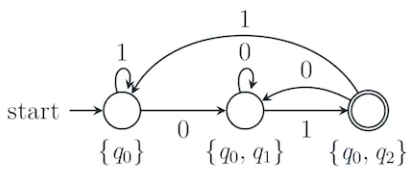

### 带有空转移的非确定有穷自动机

空转移是指在某一状态下，自动机可以不接受任何输入，直接转换到某个状态的能力。换言之，自动机可以接受空串实现转移。

状态的空转移是指允许状态因空串$\epsilon$而转移，即不消耗输入字符就发生状态的改变。状态的空转移有利于进一步简化自动机。仍然使用之前的例子：

**Example**: 设计 $L = \{w\in\{0,1\}^* | w 倒数3个字符至少有一个是1 \}$ 对应的 NFA。

在之前的 DFA 中，我们给出如下解：

对于 NFA，由于引入了不确定性，可以写出这样的解：

其中如果倒数第一个是 1 就从$q_0$直接跳转到$q_3$，如果倒数第二个是 1 就跳转到$q_2$，如果倒数第三个是 1 就跳转到$q_3$。

而对于**带有空转移**的设计，可以写出这样的解：

也就是说，如果一旦进入倒数第三个状态$q_1$或倒数第二个状态$q_2$，就可以直接通过空转移直接到$q_3$接受状态。它的状态转移表是：

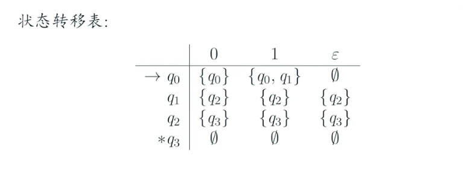

即在原本的状态转移表中增加了空转移的列。

:::success
**定义**：带空转移的非却似那个有穷自动机（$\epsilon-NFA$）A 为五元组

$$
A = (Q,\Sigma,\delta,q_0,F)
$$

- $Q$：有穷状态集
- $\Sigma$：字母表或有穷输入符号集
- $\delta$：$Q\times (\Sigma\cup\{\epsilon\}) \rightarrow 2^Q$，状态转移函数
- $q_0 \in Q$：初始状态
- $F \subseteq Q$：终结状态集或接受状态集
  :::

$\epsilon-NFA$、NFA 与 DFA 之间的主要区别：

- $\epsilon-NFA$及 NFA 在某状态，读入某个字符时，可能有多个转移；
- $\epsilon-NFA$及 NFA 在某状态，读入某个字符时，可能没有转移；
- $\epsilon-NFA$在某状态，可能不读入字符，就进行转移。

:::danger
请注意，此后不再明确区分$\epsilon-NFA$及 NFA，而统一认为它们都是 NFA。NFA 本身就与有非确定性和空转移，只是在学习时做出了区分。
:::

## 正则表达式

正则表达式通过表达式描述正则语言，与有穷自动机具有等价性。

### 语言的运算

设 $L$ 和 $M$ 是两个语言，那么有：

- 并

  $$
  L\cup M = \{w | w\in L\, or\, w\in M\}
  $$

- 连接

  $$
  L\cdot M = \{w|w=xy,x\in L\,and\,y\in M\}
  $$

- 幂

  $$
  \begin\{align\}
  L^0 &= \{\epsilon\}\\
  L^1 &= L\\
  L^n &= L^{n-1}\cdot L
  \end\{align\}
  $$

- 克林闭包
  $$
  L^* = \bigcup^\infty_{i=0} L^i
  $$

**Example**: 若有语言 $L=\{0,11\}$ 和 $M = \{\epsilon,001\}$，那么：

$$
\begin\{align\}
L\cup M &= \{0,11,\epsilon,001\}\\
LM &= \{0,0001,11,11001\}\\
ML &= \{0,11,0010.00111\}\\
L^0 &= \{\epsilon\}\\
L^1 &= \{0,11\}\\
L^2 &= \{00,011,110,1111\}\\
\forall n\geq 1&,\left\{
\begin\{align\}
\emptyset^0 & = \{\epsilon\} \\
\emptyset^n & = \emptyset \\
\emptyset^* & = \{\epsilon\}\\
\{\epsilon\}^0 &=\{\epsilon\}\\
\{\epsilon\}^n &= \{\epsilon\}\\
\{\epsilon\}^* &= \{\epsilon\}\\
\Sigma^0 &= \{\epsilon\}\\
\Sigma^n &= \{x|x是\Sigma上长度为n的串\}\\
\Sigma^n &= \{x|x是\Sigma上的任意串\}\\
\{\Sigma^*\}^0 &= \{\epsilon\}\\
\{\Sigma^*\}^n &= \Sigma^*\\
\{\Sigma^*\}^* &= \Sigma^*\\
\end\{align\}
\right.
\end\{align\}
$$

:::success
**定义**：如果 $\Sigma$ 为字母表，则 $\Sigma$ 上的正则表达式递归定义为：

1. $\emptyset$ 是一个正则表达式，表示空语言；
2. 集合 $\mathbf\epsilon$ 是一个正则表达式，表示语言 $\epsilon$；
3. $\forall a \in \Sigma$，$a$ 是一个正则表达式，表示语言 $\{a\}$；
4. 如果一个正则表达式 $r$ 和 $s$ 分别表示语言 R 和 S，那么：$r + s, rs,r^*$ 和 $(r)$ 都是正则表达式，分别表示语言 $R\cup S, R\cdot S, R^*$ 和 $R$。
   :::

正则表达式的运算有：

- $()$ 括号，优先级最高的运算。
- $*$ 闭包，或者直接读“星”，优先级次之。
- $\cdot$ “连接”运算，优先级再次之。
- $+$ “加”运算，优先级最低。

**Example**:

$$
\begin\{align\}
1+01*&=1+(0(1*))\\
&\neq 1+(01)*\\
&\neq (1+01)*\\
&\neq (1+0)1*
&\end\{align\}
$$

对 $1+01*$ 来说，由于 $1^* = \{\epsilon,1,11,111...\}$，所以该正则对应的语言的字符串集合是：

$$
\{1,0,01,011,0111...\}
$$

请注意，加号在这里表示的是并集的操作，而不是连接运算。

### 设计和解释正则表达式

**Example**: 以下是部分正则表达式示例：

|       $E$        | $L(E)$                                                                  |
| :--------------: | ----------------------------------------------------------------------- |
|      $a+b$       | $L(a)\cup L(b) = \{a\}\cup\{b\} = \{a,b\}$                              |
|       $bb$       | $L(b)\cdot L(b) =\{b\}\cdot\{b\} = \{b,b\}$                             |
|   $(a+b)(a+b)$   | $\{a,b\}\{a,b\}=\{aa,bb,ab,ba\}$                                        |
|  $(a+b)*(a+bb)$  | $\{a,b\}*\{a\}\cup \{a,b\}*\{bb\}=\{w\in\{a,b\}* \|\, w仅以a或bb结尾\}$ |
|    $1+(01)*$     | $\{1,\epsilon,01,0101,010101,...\}$                                     |
| $(0+1)*01(0+1)*$ | $\{x01y\|\,x,y\in\{0,1\}*\}$                                            |

:::warning
**典型问题**：给出正则表达式定义的语言。
:::

**Example**: 给出正则表达式 $(aa)*(bb)*(b)$ 定义的语言。

$$
\begin\{align\}
&L((aa)^*(bb)^*b)\\
=&L((aa)^* )\cdot L((bb)^*)\cdot L(b)\\
=&(\{a\}\{a\})'(\{b\} \{b\}^*\{b\}\\
=&\{ a^2 \}*\{ b^2 \}*\{b\}\\
=&\{ a^\{2n\} b^\{2m+1\} | n \geqslant 0,m \geqslant 0\}
\end\{align\}
$$

:::warning
**典型问题**：为语言设计正则表达式。
:::

==Exxample== 为语言 $L = \{w | w \in \{0,1\}* 且倒数第三个字符是1\}$ 设计正则表达式。

首先写出倒数第三个字符

$$
1
$$

由于剩下的两个字符可以是 0 或 1,因此：

$$
1(0+1)(0+1)
$$

前面可以有任意长度的字符，因此：

$$
(0+1)*1(0+1)(0+1)
$$

**Example**: 为语言 $L=\{w|w\in\{0,1\}* 且w不含有连续的0\}$ 设计正则表达式

如果只是 $L=\{w|w\in\{0,1\}*\}$的话，还是很好写出正则的：

$$
(0+1)*
$$

根据题意，这里 0 不可连续，也就是出现了 0 之后后面一定是 1，所以改写为：

$$
(01+1)*
$$

但是该正则还无法满足诸如 $0$，$01110$ 这样的以 0 结尾的串。所以需要加入这样的结尾：

$$
(01+1)*(0+\epsilon)
$$

这样就完成了正则的设计。还有另外一种设计方法：

$$
1*(011*)(0+\epsilon)
$$

:::danger
请注意，写出语言对应的正则表达式后，最好检查写出的正则是否满足了语言描述。最好使用特殊的串验证，例如空串或满足条件的长度为 1 的串。
:::

### 正则表达式的化简规则

基本的化简规则：

如果 $r$ 和 $s$ 是两个正则表达式

$$
\begin\{align\}
(\epsilon + r)* = r* & = \{\epsilon ,r,r^2,r^3,...\}\\
(\epsilon + r)r* = r* &= \{\epsilon ,r,r^2,r^3,...\}\\
\emptyset r = r\emptyset = \emptyset &= \{r,rs,rs^2,rs^3,...\}\\
\emptyset + r = r + \emptyset = r
\end\{align\}
$$

上式中最后两式分别演示了零元和单位元的特殊性质。

**Example**: 化简 $a*a$ ：

$$
a*a = a+
$$

**Example**: 化简 $(\epsilon +1)+(\epsilon +1)+(\epsilon +1)*(\epsilon +1)$

$$
\begin\{align\}
&(\epsilon +1)+(\epsilon +1)+(\epsilon +1)*=(\epsilon +1)\\
=& (\epsilon +1)\\
=& 1*
\end\{align\}
$$

上式中的 $(\epsilon +1)+(\epsilon +1)*(\epsilon +1)$ 可以化简为 $(\epsilon +1)*$。原因是 $(\epsilon +1)$ 括号里面是可以出现空串的，所以是能表示空串的。

**Example**: 化简 $0+(\epsilon +1)(\epsilon +1)*0$

$$
\begin\{align\}
&0+(\epsilon +1)(\epsilon +1)*0\\
=&0+1*0\\
=& 1*0
\end\{align\}
$$

上式中的 $0+1*0$ 可以化简为 $1*0$ 是因为 $1*$ 可以表示空串，所以 $0$ 可以合进去。

**Example**: 化简 $\emptyset + \emptyset (\epsilon+1)*(\epsilon +1)$。

$$
\emptyset + \emptyset (\epsilon+1)*(\epsilon +1)\\
=\emptyset
$$

显然，根据零元的特殊性质，直接等于 $\emptyset$。

**Example**: 化简 $\epsilon +0 +1 +\emptyset (\epsilon +1)*0$。

$$
\begin\{align\}
&\epsilon +0 +1 +\emptyset (\epsilon +1)*0\\
=& \epsilon +0 +1 +\emptyset\\
=& \epsilon +0 +1
\end\{align\}
$$

**Example**: 化简 $1*0 + 1*0(\epsilon +0 +1)*(\epsilon +0 +1)$。

$$
\begin\{align\}
&1*0 + 1*0(\epsilon +0 +1)*(\epsilon +0 +1)\\
=& 1*0+1*0(0+1)*\\
=& 1*0(0+1)*
\end\{align\}
$$

上式中 $1*0+1*0(0+1)*$ 可以化简为 $1*0(0+1)*$ 的原因是，当 $(0+1)*$ 是空串时，相当于 $1*0$ 连接一个空串，也就是它本身。

### 正则表达式与自动机的等价性

之前说到，任何一个 NFA 都可以通过不使用不确定性模拟 DFA；任何使用 NFA 都可以通过子集构造法变为 DFA；$\epsilon-NFA$可以通过不使用空转移变为 NFA，以及使用消除空转移的子集构造法变为 DFA；任何 DFA 所描述的语言都能被正则表达式所描述；接下来，只要证明任何一个正则表达式都可以被某个$\epsilon-NFA$识别，就可以证明它们的等价性。

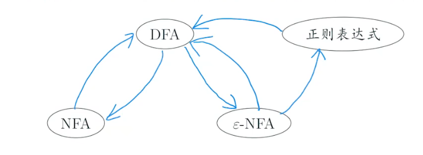

:::success
**定理**：若 $L=\mathbf{L}(a)$ 是某 DFA $A$ 的语言，那么存在正则表达式 $R$ 满足 $L=\mathbf{L}(R)$。
:::

### 由 DFA 到正则表达式

#### 由 DFA 到正则表达式之递归表达式法

这是一种由 DFA 到正则表达式的方法。

例如，状态转换图中，有一个节点 $i$ 和一个节点 $j$ ，我们希望得到全部从节点 $i$ 到 $j$ 的路径的集合，那么可以通过节点 $k$ 递归地完成：即将 $i$ 到 $j$ 描述为 $i$ 到 $k$ 和 $k$ 到 $j$ 以及 $i$ 到 $j$（不经过 $k$ ）三个部分。写成正则表达式的形式就是：

$$
R_{i,j}^k = R_{i,j}^{k-1} + R_{i,k}^{k-1}(R_{k,k}^{k-1})*R_{k,j}^{k-1}
$$

注：上式中 $k-1$ 表示“不经过$k$”。

这三种路径中的任何一种都不会经过 $k$（只会以 $k$ 为端点）。对于上式中等号后出现的任何路径，继续递归执行这个过程，直到所有路径都不经过任何节点（直接相连）：

$$
R_{i,j}^0=\left\{
\begin\{align\}
&\{a | \delta(q_i,a) = q_j\}, & i\neq j\\
&\{a|\delta(q_i,a) = q_j\}\cup\{\epsilon\}, & i=j
\end\{align\}
\right.
$$

注：上述 $i=j$ 的情况表示节点与自己直接相连。

:::warning
**典型问题** 将状态转移图对应的 DFA 转换为正则表达式
:::

例如：将下图的 DFA 转化为正则表达式：

1. 计算 $R_{i,j}^0$（画表格）：

| $R_{i,j}^{(k)}$ |       $k=0$        |
| :-------------: | :----------------: |
| $R_{1,1}^{(0)}$ | $\epsilon +\{1\}$  |
| $R_{1,2}^{(0)}$ |      $\{0\}$       |
| $R_{2,1}^{(0)}$ |    $\emptyset$     |
| $R_{2,2}^{(0)}$ | $\{0,1\}+\epsilon$ |

2. 继续计算 $R_{i,j}^1$：

根据刚才的递归式：

$$
R_{i,j}^k = R_{i,j}^{k-1} + R_{i,k}^{k-1}(R_{k,k}^{k-1})*R_{k,j}^{k-1}
$$

所以有：

$$
R_{i,j}^1 = R_{i,j}^{0} + R_{i,1}^{0}(R_{1,1}^{0})*R_{1,j}^{0}
$$

所以新的表格中具有如下行：

$$
\begin\{align\}
R_{1,1}^1 &= R_{1,1}^{0} + R_{1,1}^{0}(R_{1,1}^{0})*R_{1,1}^{0}\\
R_{1,2}^1 &= R_{1,2}^{0} + R_{1,1}^{0}(R_{1,1}^{0})*R_{1,2}^{0}\\
R_{2,1}^1 &= R_{2,1}^{0} + R_{2,1}^{0}(R_{1,1}^{0})*R_{1,1}^{0}\\
R_{2,2}^1 &= R_{2,2}^{0} + R_{2,1}^{0}(R_{1,1}^{0})*R_{1,2}^{0}
\end\{align\}
$$

所以 $R_{i,j}^1$ 的表格：

| $R_{i,j}^{(k)}$ |                                  $k=1$                                   |
| :-------------: | :----------------------------------------------------------------------: |
| $R_{1,1}^{(1)}$ | $(\epsilon +\{1\})+(\epsilon +\{1\})(\epsilon +\{1\})*(\epsilon +\{1\})$ |
| $R_{1,2}^{(1)}$ |             $\{0\}+(\epsilon +\{1\})(\epsilon +\{1\})*\{0\}$             |
| $R_{2,1}^{(1)}$ |        $\emptyset$+$\emptyset(\epsilon +\{1\})*(\epsilon +\{1\})$        |
| $R_{2,2}^{(1)}$ |          $(\{0,1\}+\epsilon)+\emptyset(\epsilon +\{1\})*\{0\}$           |

由于有三个状态所以要写到 $R_{i,j}^2$，所以还要继续往下写，但是为了保持简洁，在继续写下去之前要进行适当的化简（参照上文中正则表达式化简的相关部分）：

| $R_{i,j}^{(k)}$ |                                  $k=1$                                   |   simplified   |
| :-------------: | :----------------------------------------------------------------------: | :------------: |
| $R_{1,1}^{(1)}$ | $(\epsilon +\{1\})+(\epsilon +\{1\})(\epsilon +\{1\})*(\epsilon +\{1\})$ |      $1*$      |
| $R_{1,2}^{(1)}$ |             $\{0\}+(\epsilon +\{1\})(\epsilon +\{1\})*\{0\}$             |     $1*0$      |
| $R_{2,1}^{(1)}$ |        $\emptyset$+$\emptyset(\epsilon +\{1\})*(\epsilon +\{1\})$        |  $\emptyset$   |
| $R_{2,2}^{(1)}$ |          $(\{0,1\}+\epsilon)+\emptyset(\epsilon +\{1\})*\{0\}$           | $\epsilon+0+1$ |

3. 继续计算 $R_{i,j}^2$：
   $$
   R_{i,j}^{(2)} = R_{i,j}^{(1)} + R_{i,2}^{(1)}(R_{2,2}^{(1)})*R_{2,j}^{(1)}
   $$
   同理经过计算和化简，可以得到 $R_{i,j}^2$ 的表格

| $R_{i,j}^{(k)}$ |    $k=2$    |
| :-------------: | :---------: |
| $R_{1,1}^{(2)}$ |    $1*$     |
| $R_{1,2}^{(2)}$ | $1*0(0+1)*$ |
| $R_{2,1}^{(2)}$ | $\emptyset$ |
| $R_{2,2}^{(2)}$ |  $(0+1)*$   |

4. 从上表中选取一个从 1 到 2 的正则表达式也就是 $R_{1,2}^{(2)}$：

:::note
有趣的是，我们只要选取上表中的一个由开始状态到接受态的作为最终答案即可。在实际解题的过程中，可以只写出一个总表，而不需要分开列出每个状态的表格。
:::

该 DFA 的正则表达式为：

$$
R_{1,2}^{(2)} = 1*0(0+1)*
$$

**Example**:

将如图的 DFA 转换为正则表达式：

根据前例的知识，由于有两个终态 $q_2$ 和 $q_3$ 我们最终要得出的是 $R_{1,3}^{(3)}$ 和 $R_{1,2}^{(3)}$ 两个正则并运算的结果 $R_{1,3}^{(3)}+R_{1,2}^{(3)}$

---

#### 由 DFA 到正则表达式之状态消除法

这是一种通过在 DFA 中逐渐删除状态来得到正则表达式的方法。其主要步骤可以描述为：

1. 从 DFA 中逐个删除节点（状态），这会同时导致与之相连的边（路径）被删除。
2. 用标记了正则表达式的信边替换连接被删除的路径。
3. 进行每一步时保持自动机的等价性。

正则表达式中有三种运算，分别是连接、加、闭包。这三种运算和正则表达式边的写法的关系是：

以及更复杂的情况：

当要消除的节点具有 $n$ 个入度和 $m$ 个出度时，删除该节点需要新增 $m\times n$ 条边。

:::warning
**典型问题** 利用状态消除法，将状态转移图对应的 DFA 转换为正则表达式
:::

例如：利用状态消除法，构造下图自动机的正则表达式

注：该步骤中如果有多个接受状态，则全部通过空转移连接到新增的 $f$ 状态；新增的开始状态也是通过空转移连接到原开始状态的。

:::note
这样做是为了让最终化简的图只有一条边，从开始的 $s$ 连接到结束的 $f$。
:::

因此该 DFA 的正则表达式是：

$$
1*00*1(00*1+11*00*1)*
$$

### 由正则表达式构造 epsilon-NFA

:::success
**定理**：正则表达式定义的语言，都能被有穷自动机识别
:::

任何正则表达式 $e$，都存在与其等价的 $\epsilon -NFA$，即 $L(A) = L(e)$，并且 $A$ 满足：

- 仅有一个接受状态
- 没有进入开始状态的边
- 没有离开接受状态的边

如果上述条件无法被满足，参照上文中添加新的开始状态和结束状态并增加相应的转移。

例如：将正则表达式 $(0+1)*1(0+1)$ 构造为 $\epsilon -NFA$。

注意，上图中有一部分空转移的作用仅仅是连接。

### 正则表达式的代数定律

:::success
**定义**：含有变量的两个正则表达式，如果以任意语言替换其变量，二者所表示的语言仍然相同，则称这两个正则表达式等价。在这样的意义下，正则表达式满足一些代数定律。
:::

**并运算**

$$
\begin\{align\}
(L+M)+N &= L+(M+N)\\
L+M&=M+L\\
L+L&=L\\
\emptyset +L &= L +\emptyset = L
\end\{align\}
$$

**连接运算**

$$
\begin\{align\}
(LM)N &= L(MN)\\
\epsilon L &= L\epsilon = L\\
\emptyset L &= L\emptyset = \emptyset\\
LM &\neq ML
\end\{align\}
$$

**分配律**

$$
\begin\{align\}
L(M+N) &= LM+LN\\
(M+N)L &= ML + NL
\end\{align\}
$$

**闭包运算**

$$
\begin\{align\}
(L*)* &= L*\\
\emptyset * &= \mathbf\epsilon\\
\epsilon * &= \mathbf\epsilon\\
L* &= L^+ + \mathbf\epsilon\\
(\epsilon +L)* &= L*
\end\{align\}
$$

:::note
如果要判断两个正则表达式 $E$ 和 $F$（其中变量为 $L_1,....L_n$ ）是否等价：

- 将变量替换为具体表达式，得到正则表达式 $r$ 和 $s$，例如，将 $L_i$ 替换为 $a_i$；
- 判断 $L(r) == L(s)$，如果相等则 $E=F$，否则 $E\neq F$。
  :::

**Example**: 判断 $(L+M)* == (L*M*)*$

1. 将 $L$ 和 $M$ 替换为 $a$ 和 $b$
2. $(a+b)* = (a*+b*)*$
3. 因为 $L((a+b)*) = L((a*+b*)*)$ 所以 $(L+M)* = (L*M*)*$

**Example**: 判断 $L+ML = (L+M)L$

1. 将 $L$ 和 $M$ 替换为 $a$ 和 $b$
2. 判断 $a+ba = (a+b)a$
3. 举个反例，$aa\notin \mathbf\{a+ba\}$ 而 $aa\in \mathbf\{(a+b)a\}$
4. 所以 $a+ba \neq (a+b)a$，即 $L+ML \neq (L+M)L$

:::danger
注意，这种使用实例的方法仅限于判断正则表达式是否相等，不能用于判断字典是否相等。

:::

### 正则语言的性质

:::success
**定理：正则语言的泵引理** 如果语言 $L$ 是正则的，那么存在正整数 $N$，对 $\forall w \in L$，只要 $|w|\geq N$，就可以将 $w$ 分为三个部分 $w = xyz$ 满足：

- $y \neq \epsilon (|y|>0)$
- $|xy|\neq N$
- $\forall k \neq 0, xyz \in L$

泵引理是正则的必要条件，如果一个语言是正则的，那它一定满足泵引理。泵引理只能用于证明某个语言不是正则的。

:::

**Example**:

证明 $L_\{01\} = \{0^n1^n  | n\geq 0\}$ 不是正则语言。

:::note
利用泵引理证明语言的非正则，基本思路是反证法，假设该语言正则，利用泵引理中的理论推出矛盾，说明该语言不是正则。
:::

:::note
刚才证明了 $L_\{01\}=\{0^n1^n|n\geq 0\}$ 不是正则语言，$L_\{01\}\subseteq L_{eq}$，则不能说明 $L_{eq}$ 不是正则语言。例如：

$$
L_\{01\} \subseteq \Sigma^* = (0+1)*
$$

显然 $\Sigma^*$ 是正则的。所以不能用一个语言非正则来说明包含它的语言非正则。
:::

**Example**: 证明 $L=\{0^i1^j | i > j\}$ 不是正则的。

:::note
和上面的例子同理，由于 DFA 不能记住任意数量的 0，所以显然它确实不是正则的。
:::

**Example**: 证明 $L=\{a^3b^nc^{n-3} | n \geq 3\}$ 不是正则的。

:::note
注意，上例中，对于情况复杂的 $y$，需要将每种情况的反例都找到。
:::

---

## 文法

:::success
**定义**：文法（grammar）$G$ 是一个四元组：

$$
G = (V,T,P,S)
$$

其中：

- $V$：变量（variable）的非空有穷集。$\forall A \in V$，$A$ 称为**语法变量**（syntactic variable），简记为**变量**，也可称作**非终极符号**（nonterminal）。它表示一个**语法范畴**，记作 $L(A)$。
- $T$：**终极符号**（terminal）的非空有穷集。$\forall a \in T$，$a$ 称为终极符号。显然 $T \cap V = \emptyset$。
- $P$：产生式（production）的非空有穷集。$P$ 中的元素均具有形式 $\alpha \to \beta$，称为产生式，读作“$\alpha$定义为$\beta$”。其中 $\alpha\in (V\cup T)^+$，$\beta \in (V\cup T)^*$。$\alpha$ 称为产生式 $\alpha\to\beta$ 的左部，$\beta$ 称为产生式 $\alpha\to\beta$ 的右部。产生式也叫做定义式或语法规则。
- $S$：$S\in V$，文法 $G$ 的开始符号（start symbol）。
  :::

与又穷状态自动机、下推自动机等一样，上述关于文法的定义给出的也是语言描述的一种模型。语言有很多形式，描述语言也有很多种方式。

### 回文串和回文语言

:::success
**定义** 如果字符串 $w\in \Sigma^*$ 满足

$$
w = w^R
$$

则称字符串 $w$ 为**回文**（palindrome）。如果语言 $L$ 中的字符串都是回文，则称 $L$ 为**回文语言**即

$$
L = \{w\in\Sigma^* | w = w^R\}
$$

:::

**Example**:

### 上下文无关文法

:::success
**定义** **上下文无关文法**（CFG，Context-Free Grammar，简称**文法**） $G$ 是一个四元组：

$$
G = (V,T,P,S)
$$

其中：

- $V$：变元的有穷集，变元也称为非终结符或语法范畴；
- $T$：终结字符的有穷集，且 $V\cap T = \emptyset$；
- $P$：产生式的有穷集，每个产生式包括：
  - 一个变元，称为产生式的**头**或**左部**
  - 一个产生式符号 $\rightarrow$，读作**定义为**
  - 一个产生 $(V\cup T)^*$ 中的符号串，称为**体**或**右部**
- $S\in V$：初始符号，文法开始的地方。
  :::

**Example**:

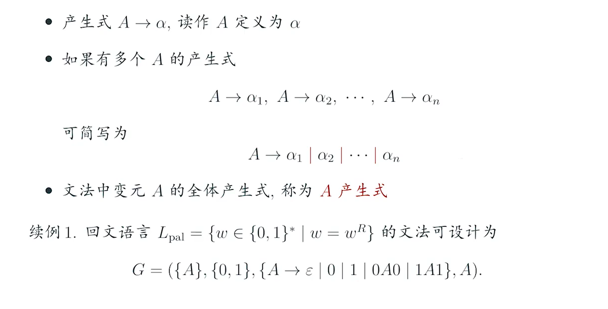

:::note
字符的一般使用约定：
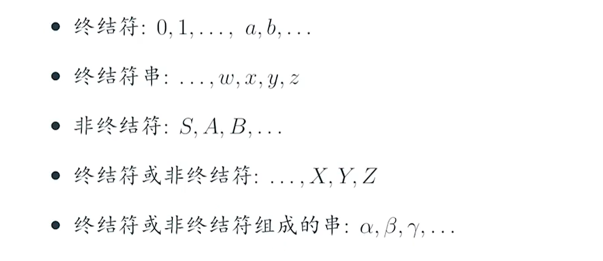
:::

**Example**:

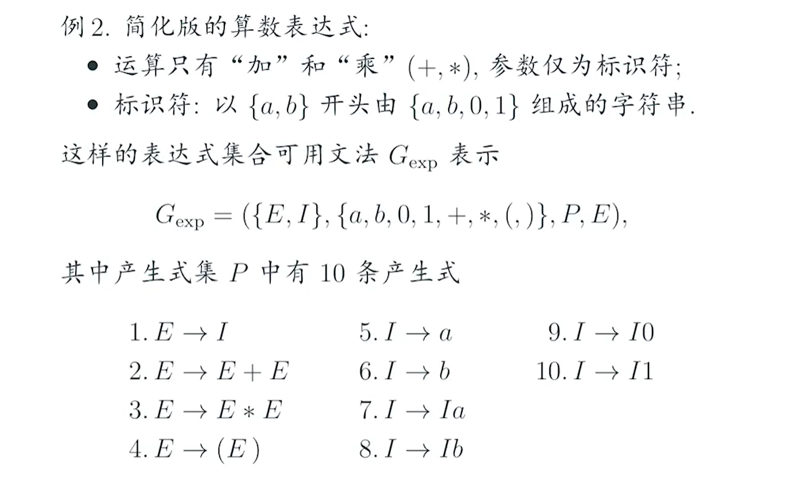

### 规约和派生

### 最左派生和最右派生

### 文法的化简

文法的形式非常自由，有时文法过于复杂不利于自动处理，为了方便分析和解决问题，**以不改变语言为前提**，化简文法和限制文法的格式。其可以被描述为三个子问题：

- 消除无用符号：对文法定义语言没有贡献的符号（不出现在任何一个由开始符号推导出的一个终结符号串的过程中的变元或终结符）
- 消除 $\epsilon -$ 产生式：$A\to \epsilon$。注意，消除 $\epsilon -$ 产生式得到的语言和原来的语言可能会差一个产生式。
- 消除单元产生式：$A\to B$（A，B 均为变元）

:::success
**定义**：**CFG** $G = (V,T,P,S)$，符号 $X\in (V\cup T)$：

- 如果 $S\Rightarrow \alpha X \beta$，称 $X$ 时可达（reachable）的
- 如果 $X\Rightarrow w(w\in T^*)$，则称 $X$ 是产生（generating）的
- 如果 $X$ 同时是产生的和可达的，即 $S\Rightarrow \alpha X \beta \Rightarrow w(w\in T^*)$，则称 $X$ 是有用的，否则称 $X$ 是无用符号。
  :::

**计算“产生的”符号集**:

- 每个 $T$ 种的而符号都是产生的（0 步推导）
- $A\rightarrow \alpha \in P$ 且 $\alpha$ 中符号都是产生的

**计算“可达的”符号集**：

- 符号 $S$ 是可达的
- $A\rightarrow \alpha \in P$ 且 $A$ 是可达的，则 $\alpha$ 中的符号都是科大的

:::success
**定义**：每个非空的呃 CFL 都能被一个不带无用符号的 CFG 定义。
:::

注意，为了避免消除不完整：

- 先寻找并消除全部 “非产生的” 符号产生式
- 再寻找并消除全部 “非可达的” 符号产生式

**Example**:

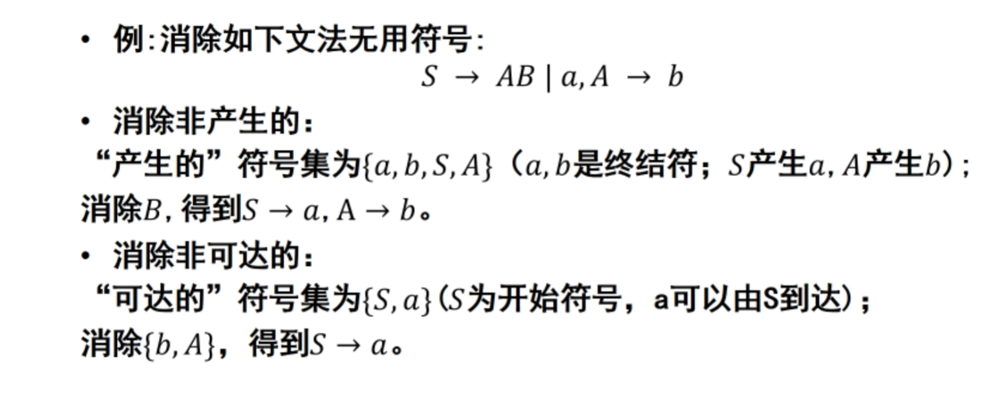

:::danger
必须使用上述消除顺序，否则会出事。
:::

:::success
**定义**：文法中形如 $A\rightarrow epsilon$ 的产生式称为 $\epsilon -$ 产生式。如果变元 $A\Rightarrow \epsilon$，则称 $A$ 是可空的。

- $\epsilon -$ 产生式在文法定义语言时，除产生空串外没有其他帮助
- 对于 CFL $L$，消除其文法中全部的 $\epsilon -$ 产生式后，得到语言 $L-\{\epsilon\}$
  :::

**确定“可空变元”**：

- 如果 $A\rightarrow \epsilon$，则 $A$ 是可空的
- 如果 $B\rightarrow \alpha$ 且 $\alpha$ 中的每个符号都是可空的，则 $B$ 是可空的

**替换产生式**：
将含有可空变元的一条产生式 $A\rightarrow X_1 X_2 ... X_n$ 用一组产生式 $A\rightarrow Y_1 Y_2 ... Y_n$ 代替，其中：

- 若 $X_i$ 不是可空的，$Y_i$ 为 $X_i$
- 若 $X_i$ 是可空的，$Y_i$ 为 $X_i$ 或 $\epsilon$（即对于每个可空变元，它可以出现或不能出现在替换后的产生式中）
- 但 $Y_i$ 不能全为 $\epsilon$

:::success
**定理**：任何 CFG $G$，都存在一个不带无用符号和 $\epsilon -$产生式 的 CFG $G$，使 $L(G') = L(G) - \{\epsilon\}$
:::

**Example**:

**确定单元对**：如果有 $A\Rightarrow B$，则称 $[A,B]$ 为单元对。

- $A\rightarrow B \in P$，则 $[A,B]$ 是单元对
- 若 $[A,B]$ 和 $[B,C]$ 都是单元对，则 $[A,C]$ 是单元对

**消除单元产生式**：

- 删除全部形为 $A\rightarrow B$ 的单元产生式
- 对于每个单元对 $[A,B]$，将 $B$ 的产生式 u 复制给 $A$

**Example**:

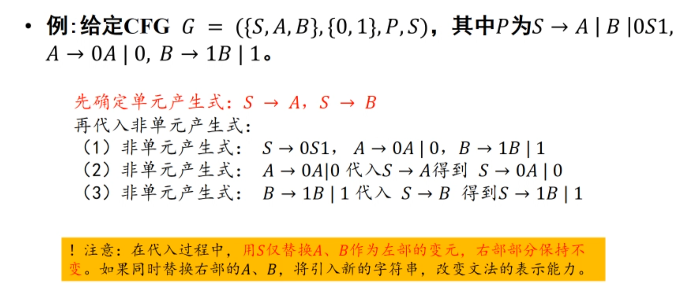
